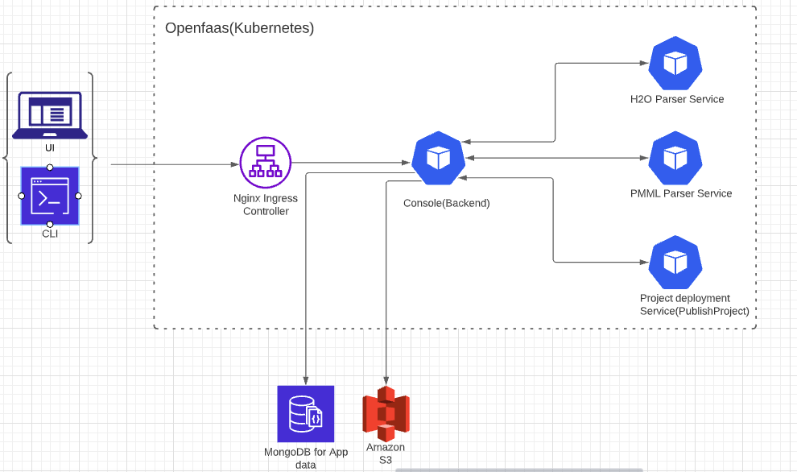

<h1 align="center">Clouderizer - Deploy your ML models and Notebooks easily</h1>

<p align="center">
  
</p>


### **What does Clouderizer do?**

Clouderizer makes it easy to deploy your ML/DL models and notebooks in CPU/GPU infrastructure thereby generating a web app/API endpoint for you to use it anywhere you want or just showcase your cool models to your customers or friends.
<br>
</br>

### **Highlights**

* Ease of deploying your models in minutes

* Ability to add pre processing and post processing functions for your models and a code editor interface to test your pre processing and post processing code.

* We have a CLI to do everything if you are a command line person.

* Can deploy your models on GPU as well.

* Use API endpoints for notebooks and our Web UI for models.

* Supports text, image, audio classification models.
<br>
</br>

### **Architecture diagrams**

<br>
</br>
<p align="center">
  
  <br>
  Clouderizer Console Architecture
</p>
<br>
<p align="center">
  
  <br>
  Clouderizer Inference Architecture
</p>
<br>
</br>

### **Quickstart**

 Refer to our [Documentation](https://docs.clouderizer.com).
<br>
</br>

### **Contributing guide**

We'd love for you to contribute to our source code and to make Clouderizer even better than it is today! Here are the guidelines we'd like you to follow:
<br>
</br>

#### **Code of Conduct**

Help us keep Clouderizer open and inclusive. Please read and follow our [Code of Conduct](./CODE_OF_CONDUCT.md).
<br>
</br>

#### **Got a Question or Problem?**

Do not open issues for general support questions as we want to keep GitHub issues for bug reports and feature requests. You've got much better chances of getting your question answered on dedicated support platforms, the best being Stack Overflow.
Stack Overflow is a much better place to ask questions since:

* there are thousands of people willing to help on Stack Overflow.

* questions and answers stay available for public viewing so your question / answer might help someone else.

* Stack Overflow's voting system assures that the best answers are prominently visible.
<br>
</br>

#### **Found an Issue or Bug?**

If you find a bug in the source code, you can help us by submitting an issue to our [GitHub Repository](https://github.com/clouderizer/clouderizer/issues). Even better, you can submit a Pull Request with a fix.
Please see the [Issue Submission Guidelines](#issue-submission-guidelines) below.
<br>
</br>

#### **Missing a Feature?**

You can request a new feature by submitting an issue to our [GitHub Repository](https://github.com/clouderizer/clouderizer/issues).

If you would like to implement a new feature then consider what kind of change it is:

* Major Changes that you wish to contribute to the project should be discussed first in our [GitHub Issues](https://github.com/clouderizer/clouderizer/issues) that clearly outlines the changes and benefits of the feature.

* Small Changes can directly be crafted and submitted to the [GitHub Repository](https://github.com/clouderizer/clouderizer) as a Pull Request. See the section about [Submitting a Pull Request (PR)](#submit-pull-request)
<br>
</br>

#### **Want a Doc Fix?**

Should you have a suggestion for the documentation, you can open an issue and outline the problem or improvement you have - however, creating the doc fix yourself is much better!

If you want to help improve the docs, it's a good idea to let others know what you're working on to minimise duplication of effort. Create a new issue (or comment on a related existing one) to let others know what you're working on.
If you're making a small change (typo, phrasing) don't worry about filing an issue first. Use the friendly blue "Improve this doc" button at the top right of the doc page to fork the repository in-place and make a quick change on the fly. The commit message is pre formatted to the right type and scope, so you only have to add the description.
For large fixes, please build and test the documentation before submitting the PR to be sure you haven't accidentally introduced any layout or formatting issues. You should also make sure that your commit message follows the [Commit Message Guidelines](#commit-message-format).
<br>
</br>

### **License**

Clouderizer is [MIT licensed](./LICENSE).
<br>
</br>

### **Submit Pull Request**

* click on the Fork button in the top-right corner of out [GitHub Repository](https://github.com/clouderizer/clouderizer).

* The copy includes all the code, branches, and commits from the original repo.

* Next, clone the repo by opening the terminal on your computer and running the command:

```shell
    git clone https://github.com/<YourUserName>/clouderizer
```

* Once the repo is cloned, you need to do two things:

    1. Create a new branch by issuing the command:

    ```shell
        git checkout -b new_branch
    ```

    2. Create a new remote for the upstream repo with the command:

    ```shell 
        git remote add upstream https://github.com/clouderizer/clouderizer
    ```

* In this case, "upstream repo" refers to the original repo you created your fork from.

* Once you add, commit and push the changes to your repo, the Compare & pull request button will appear in GitHub.

* Open a pull request by clicking the Create pull request button. This allows the repo's maintainers to review your contribution. From here, they can merge it if it is good, or they may ask you to make some changes.


**TLDR**

In summary, if you want to contribute to a project, the simplest way is to:

1. Find a project you want to contribute to

2. Fork it

3. Clone it to your local system

4. Make a new branch

5. Make your changes

6. Push it back to your repo

7. Click the Compare & pull request button

8. Click Create pull request to open a new pull request
<br>
</br>

### **Issue Submission Guidelines**

Before you submit your issue search the archive, maybe your question was already answered.
If your issue appears to be a bug, and hasn't been reported, open a new issue. Help us to maximise the effort we can spend fixing issues and adding new features, by not reporting duplicate issues.

In general, providing the following information will increase the chances of your issue being dealt with quickly:
* Overview of the Issue - if an error is being thrown a non-minified stack trace helps

* Motivation for or Use Case - explain why this is a bug for you.

* Browsers and Operating System - is this a problem with all browsers or only specific ones?

* Reproduce the Error - provide a live example (using Plunker or JSFiddle) or an unambiguous set of steps.

* Related Issues - has a similar issue been reported before?

* Suggest a Fix - if you can't fix the bug yourself, perhaps you can point to what might be causing the problem (line of code or commit).
<br>
</br>

### **Coding Rules**
To ensure consistency throughout the source code, keep these rules in mind as you are working:

* All features or bug fixes must be tested by one or more specs (unit-tests).

* All public API methods must be documented.
<br>
</br>

### **Commit Message Format**
Each commit message consists of a **header**, a **body** and a **footer**.  The header has a special
format that includes a **type**, a **scope** and a **subject**:

```
<type>(<scope>): <subject>
<BLANK LINE>
<body>
<BLANK LINE>
<footer>
```

The **header** is mandatory and the **scope** of the header is optional.

Example — `fix: remove unused dependency lodash.camelcase`

Any line of the commit message cannot be longer 100 characters. This allows the message to be easier to read on GitHub as well as in various git tools.

#### **Type**
Must be one of the following:

* **feat**: A new feature.
* **fix**: A bug fix.
* **docs**: Documentation only changes.
* **style**: Changes that do not affect the meaning of the code (white-space, formatting, missing semi-colons, etc).
* **refactor**: A code change that neither fixes a bug nor adds a feature.
* **perf**: A code change that improves performance.
* **test**: Adding missing tests.
* **chore**: Changes to the build process or auxiliary tools and libraries such as documentation generation.

#### **Scope**
The scope is optional and could be anything specifying place of the commit change. For example `nsis`, `mac`, `linux`, etc...

#### **Subject**
The subject contains succinct description of the change:

* use the imperative, present tense: `change` not `changed` nor `changes`,
* don't capitalize first letter,
* no dot (.) at the end.

#### **Body**
Just as in the **subject**, use the imperative, present tense: "change" not "changed" nor "changes".
The body should include the motivation for the change and contrast this with previous behavior.

#### **Footer**
The footer should contain any information about **Breaking Changes** and is also the place to reference GitHub issues that this commit **Closes**.

**Breaking Changes** should start with the word `BREAKING CHANGE:` with a space or two newlines. The rest of the commit message is then used for this.

A detailed explanation can be found in this [document](https://docs.google.com/document/d/1QrDFcIiPjSLDn3EL15IJygNPiHORgU1_OOAqWjiDU5Y/edit#).
<br>
</br>

### **Examples**

[GitHub link](https://github.com/clouderizer/examples) to our example projects:
<br>
</br>
 
### **Roadmap**

* CSV support for Inference.

* Improve the performance of our Analytics Dashboard.

* Implement fail fast mechanism whereever possible.

* Make Clouderizer a full fledge MLOps platform.
<br>
</br>

### **Instructions to setup Clouderizer locally**

#### **Note**: The below setup script is for GCP. If you want to setup a kubernetes cluseter locally or on any other cloud platform, change the setup_openfaas_k8.sh as needed.

Please follow below steps to setup Clouderizer.

* Go to clouderizer_setup folder.

* Edit openfaas/values.yaml file to change .queueworker.baseurl to your main domain name and .ingress.hosts[0].host, .ingress.tls[0].hosts[0] to serverless domain name.

* Edit console-config.js for MongoDB config, base_url, sync_url(openfaas gateway URL), serverlessURL, serverlessSyncURL, GCS or any S3 API supported cloud provider credentials, docker repo config, mailgun config with your config values.

* Edit console-ingress.yaml to change .spec.domain to your main domain name.

* Edit letsencrypt-issuer.yaml to change .spec.acme.email to your email address.

* Get your own gcloud service key json file which has access to gcp's Cloud Build and GCR. A sample file gcloud-service-key.json is provided in the folder.

* Make sure faas cli is installed (curl -sSL https://showcase.clouderizer.com/givemefaascli | sh)

* Execute bash script setup_openfaas_k8.sh with arguements(command: bash setup_openfaas_k8.sh <zone> <machinetype> <clustername> <number_of_nodes> <docker_server> <docker_username> <docker_password> <docker_email> <openfaas_gateway_URL>)

* Your cluster should be up and running with all the resources.


