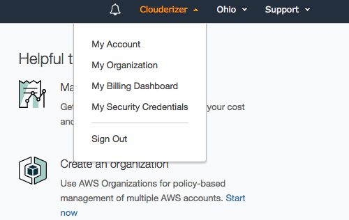
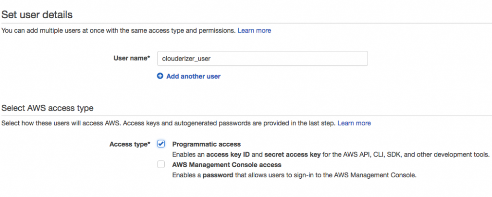
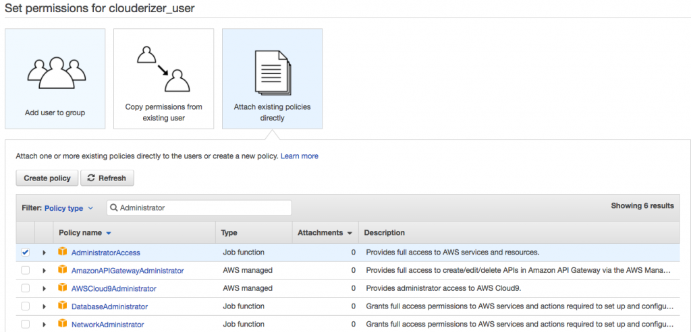
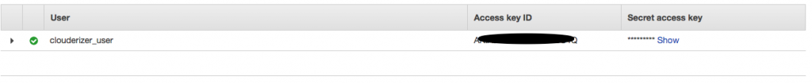
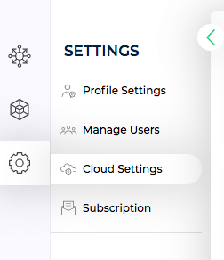
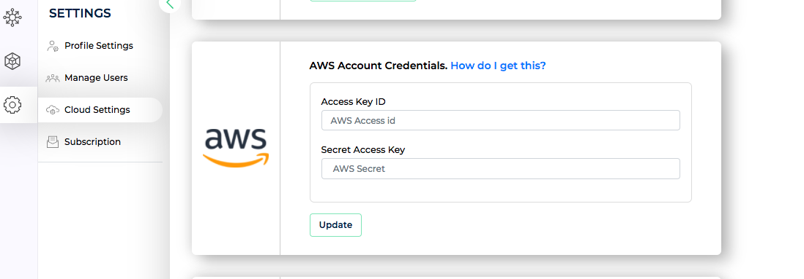

Clouderizer has in-built deep integration with AWS. You can link your Clouderizer account with your AWS account, which allows you to create, configure, manage and delete AWS resources (including spot instances) from Clouderizer console itself. Below are the steps to do so

## Steps
1. [Login](https://showcase.clouderizer.com) to your AWS account (Sign Up in case you don’t have one already)
2. Click on the name of your account (it is located in the top right corner of the console). In the expanded            drop-down list, select My Security Credentials.
   
3. Click on Get Started with IAM Users button.
4. On next screen, click Add user button to add a new user for Clouderizer.
5. Give a username e.g. clouderizer_user and set Access type to Programmatic access. Press Next.
  
6. Select option ``Attach existing policies directly``. Then from list below search and select AdministratorAccess policy. Press Next.
  
7. Confirm the settings and press Next. Now you should see the success message with Access key ID and Secret access key. Note down both the values (you will need to press Show to view Secret access key).
  
8. Now login to your Clouderizer console and go to Settings->Cloud Settings.
  
  *Cloud Settings* 
9. Enter the Access Key ID and Secret Access Key from step 7 above, and press Update.

*AWS Settings* 

Thats it. Your Clouderizer account is now integrated with your AWS account. You can now create projects with AWS SPOT instances, get best recommended bidding price for your configuration, start and stop those machines from Clouderizer console itself.