Clouderizer can link with your GCP account to allow you run your projects seamlessly from within Clouderizer console itself. In case you have not already signed up for GCP account, you can enable GCP from any of your gmail account from here and get $300 free credit for first year. This credit is good enough for almost 1000 hours of Nvidia Tesla K80 GPUs!! 

You will need to setup your billing info here but Google won't charge you anything unless you run out of your free credits and give your explicit consent for charge.

## New GCP Users

This section describes how to start Clouderizer with Google Compute environment using the available Cloud Launcher offering. This guide explains how to set up Google Cloud Platform (GCP) for your ML / AI projects. 

###GCP Signup

1. Signup for new GCP account from [here](https://cloud.google.com/free/).
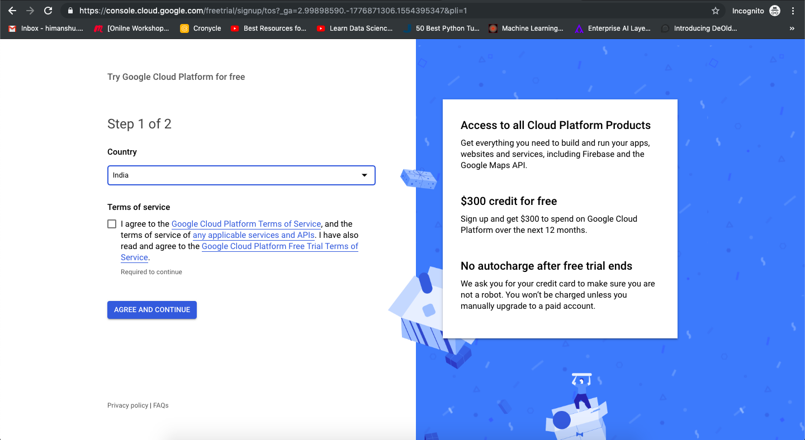

 
2. Google asks for your credit card information when you sign up for the free trial [(i)](https://cloud.google.com/free/docs/gcp-free-tier)
 

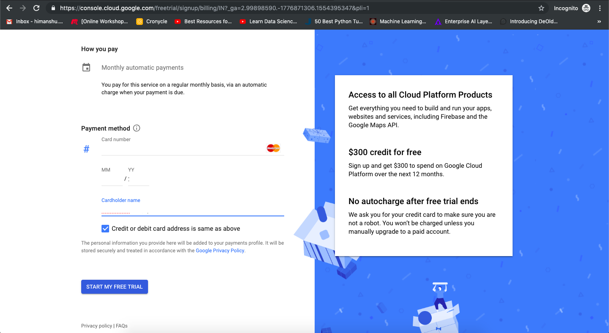
 
3. Once the billing setup is done you will land to the console
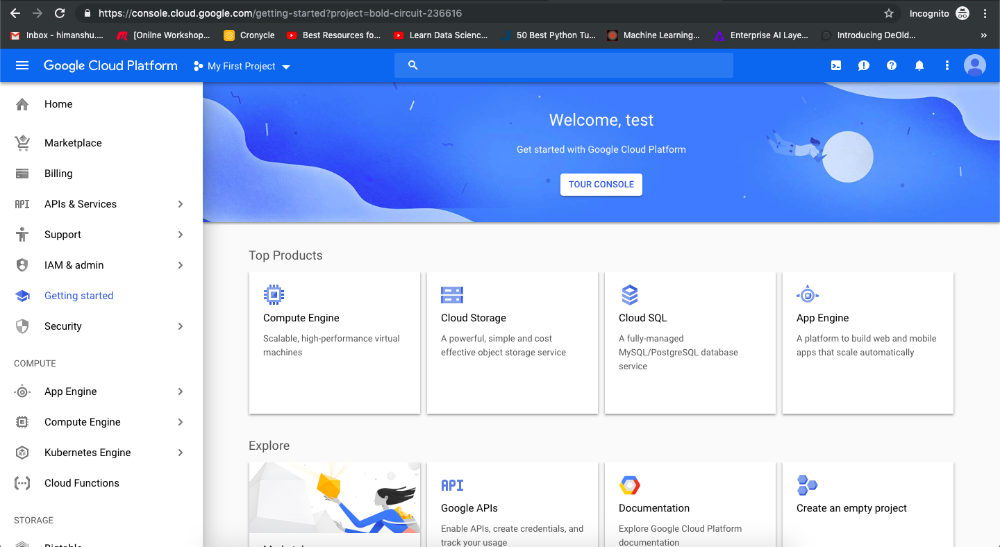
 

###Requesting GPU Quota
 
1. Click on "IAM and admin" and then "Quotas"
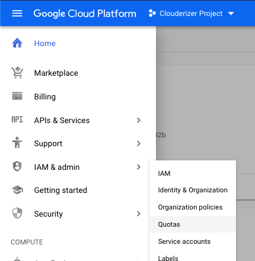

 
2. In "Metric" click on "None", then search "GPU" and select "GPUs (all regions)"

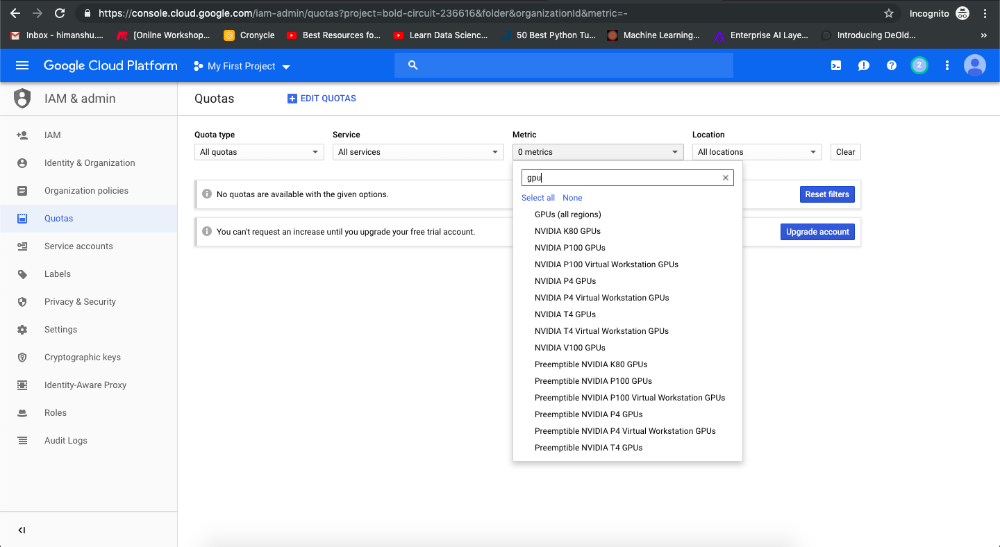
 
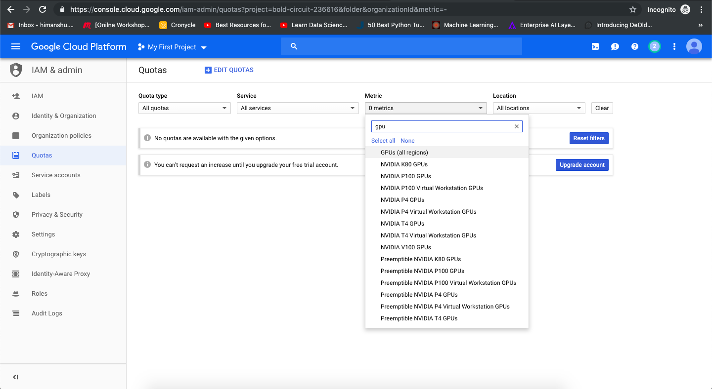
 
3. You need to upgrade your account to access GPU

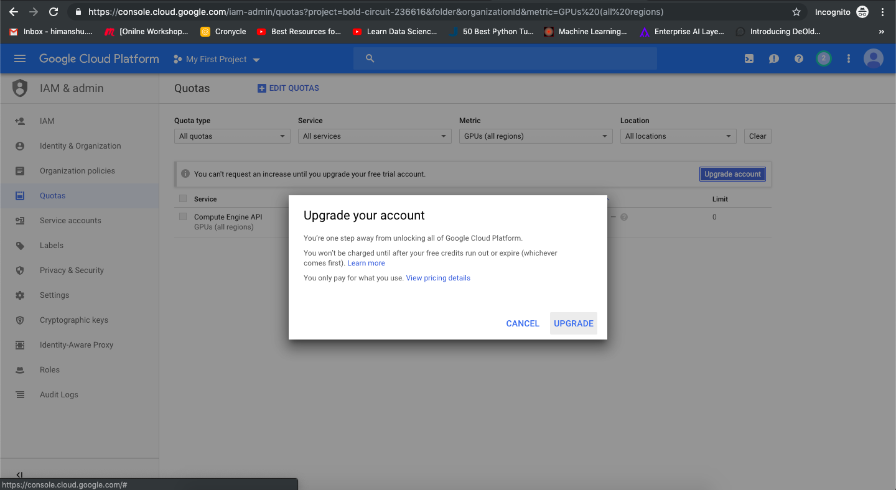
 
4. Select the "Compute Engine API" and then click "Edit Quotas" as current GPU limit is "0"

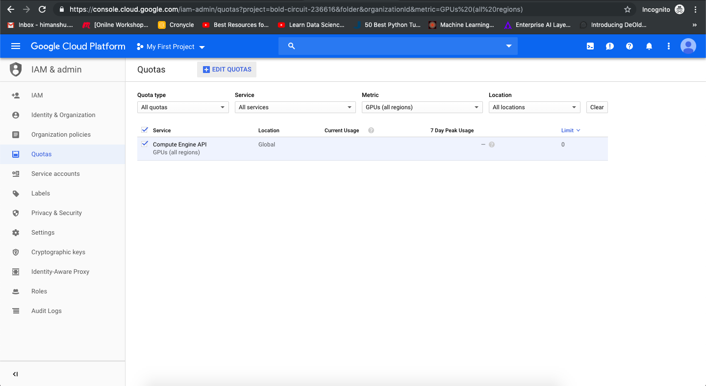
 
5. Edit Quotas → Change to “1”. Enter some description for your quota request under "request description"
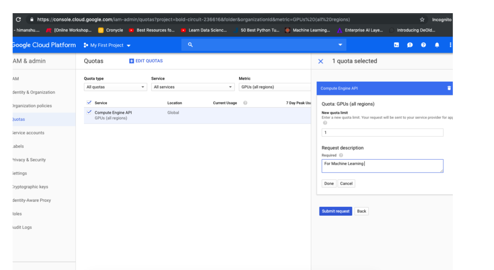
 

Once you submit quota request, Google team will review and get back to you in email like below

6.GPU quota is generally credited within an hour time
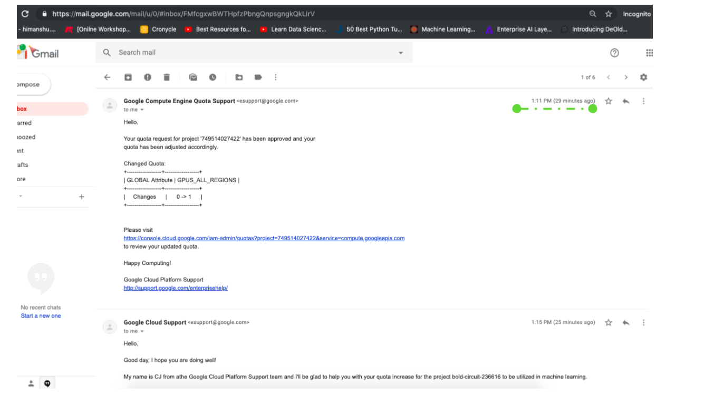
 

Now you can follow below instructions for setting up Google Service Account.

## Existing GCP Users (Google Service Account) 
A service account is a special type of Google account intended to represent a non-human user that needs to authenticate and be authorized to access data in Google APIs.

!!! tip 
       Prerequisite
 
        • Billing Setup done
        
        • Having Valid GPU Quota 
         

You can integrate your Clouderizer account with your GCP account via Service Account.  One just need to specify the JSON file from his GCP account and can login into our Clouderizer. Next next few steps will expand how to setup account

Login to your GCP Console:

1. Once logged in go to “APIs & Services” and select “Credentials”
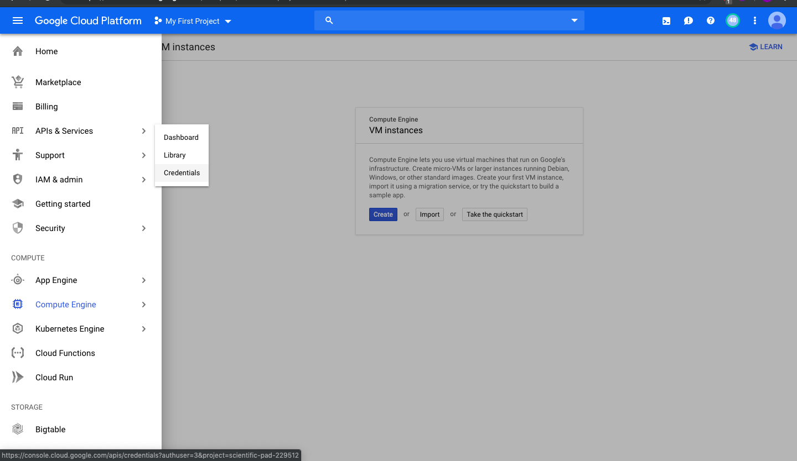

  
2. In “Credentials” go to “Service account key”
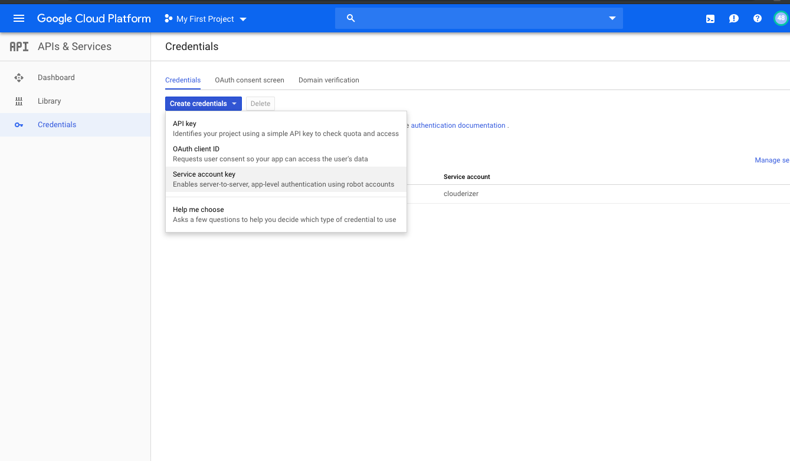

3.Click on “New service account” 
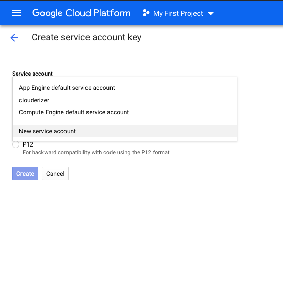

4.Type a "Name" for this service account. 
Under "Key type," select "JSON"
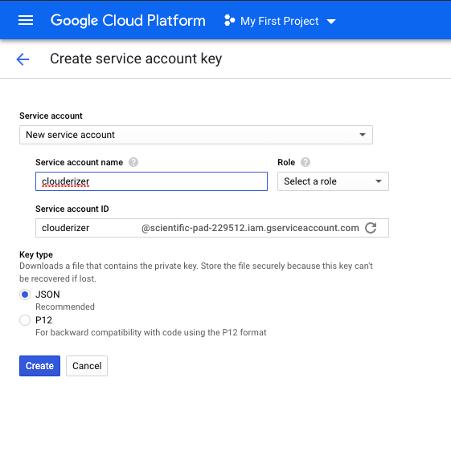

5.Click on “Role” --> “Compute Engine”. Select “Compute Admin” and "Storage Admin". These are the roles needed by Clouderizer to manage your projects. Click "Create", and the GCP Console will generate a JSON key (as a .json text file), prompt you to download the file to your computer”

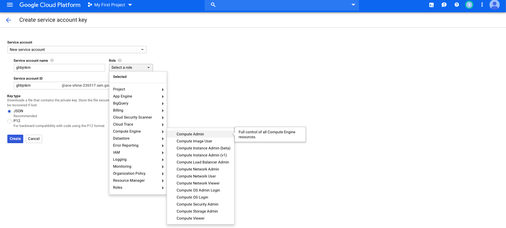

!!! Warning 
         Store this JSON file securely, as it contains your private key (and this file is the only copy of that key)
 

Login to [Clouderizer](https://console.clouderizer.com/auth/login)
   
6.Now go to Settings --> Cloud Setting --> Google Service Account Credentials --> Choose file--> Upload the Json file --> Upload GCP Credentials

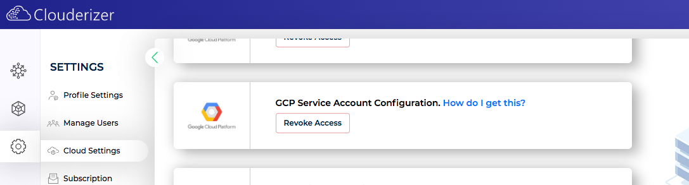

 
 
!!! success
           Thats it. Your Clouderizer account is now integrated with your GCP account. 

[Understanding GCP service accounts!](https://cloud.google.com/iam/docs/understanding-service-accounts)
