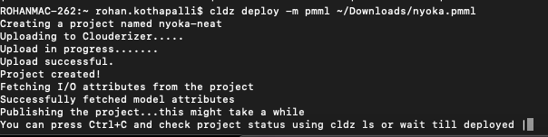

### Deploy Notebooks

#### Syntax

```cldz deploy -n python PATH_TO_JUPYTER_NOTEBOOK {REQUIREMENTS_TXT}```

```-n``` flag tells ```cldz``` that deployment is of type notebook. Immediately after -n we follow up with the notebook kernel type. Following kernels are supported

* python
* R (coming soon)
* julia (coming soon)

If no flag is given, ```cldz``` assumes the first argument is a python based jupyter notebook and second argument is a requirements file.
#### Example
```cldz deploy -n python awesome-notebook.ipynb requirements.txt```

#### Async Endpoints

Notebook deployments support Async serverless endpoints. This is useful as often Notebook execution is a long running operation. Async endpoints can be invoked via any http client like curl. Caller can specify a callback URL (webhook) in its http invocation under header ```X-callback-url```. Serverless function immediately replies back with 202 request accepted response code and continue to execute the notebook. Once notebook execution is complete, the callback URL (webhook) is called with the result. In addition to this webhook, output of the invocation can also be viewed under **Invocation History** on Clouderizer console.

### Deploy Models

#### Syntax

```cldz deploy -m MODEL_TYPE PATH_TO_H2O_MODEL_FILE```

```-m``` flag tells ```cldz``` that deployment is of type model. Immediately after -m we follow up with the model type. Following model types are supported

* h2o.ai MOJO model
* PMML
* Python
* ONNX

#### h2o / dai / pmml model deployment

```cldz deploy -m h2o PATH_TO_H2O_MODEL_FILE```

```-m``` flag tells ```cldz``` that deployment is of type model.

If ```-m``` is not specified,```cldz``` assumes type as notebook.

h2o in the above example can be replaced with dai / pmml.

 

#### python model deployment

Since python predict code needs to be executed.

```cldz deploy -m python PATH_TO_PYTHON_MODEL --predict predict.py```

```PATH_TO_PYTHON_MODEL``` is usually the model file we load and score in ```predict.py```.


### Pre-processing and Post-processing scripts

Does your model requires preprocess / postprocess scripts at the time of scoring?

Suppose you have a pmml model with both preprocess and postprocess files. Syntax is:

```cldz deploy -m pmml PATH_TO_PMML_FILE --preprocess preprocess.py --postprocess postprocess.py```

VERY IMPORTANT NOTE: Preprocess and postprocess flags are optional. Even mispelling the flags will deploy the model but without the mispelled arguments.

### Infra Configuration Flag

```--infra``` flag tells cldz the type of infra you want to run on.

Clouderizer currently supports 3 infra types:

1. standard - 2GB Memory
2. highmemory - 6GB Memory
3. gpu - 16GB GPU Memory, 30GB System Memory


*standard* infra type is selected by default but if you want to start a project on gpu 

!!! note
  Tensorflow 2.4+ is supported for GPU.


```cldz start PROJECT_NAME --infra gpu```

### Image Configuration Flag

```--image``` flag tells cldz the type of base image you want to run on.

Clouderizer currently supports 3 image types:

1. standard - python 3.8
2. tensorflow - python 3.8 + Tensorflow 2.4
3. torch - python 3.8 + Pytorch + Fastai + nbdev


*standard* image type is selected by default 

```cldz deploy my_notebook.ipynb --image torch```