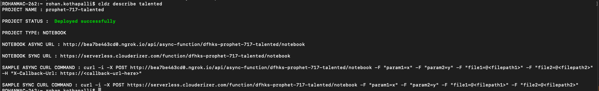
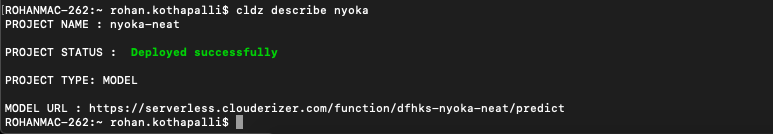

```cldz ls``` gives the project status. To get more detailed description of the state of the project ```cldz describe PROJECT_NAME```.

Notebook describe output example,



Model describe output example,

 

In case of a deployed model, the description contains model access and scoring URLs.