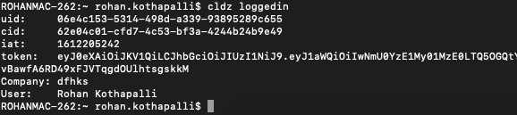

# cldz loggedin

To check your user information, execute ```cldz loggedin``` in your terminal.

 

# cldz logout

By default, user will always be logged in with cli(after the first time setup).

To logout, ```cldz logout```