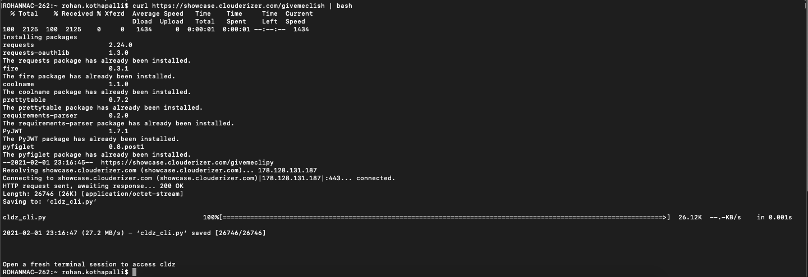
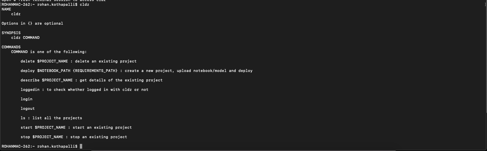
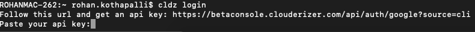
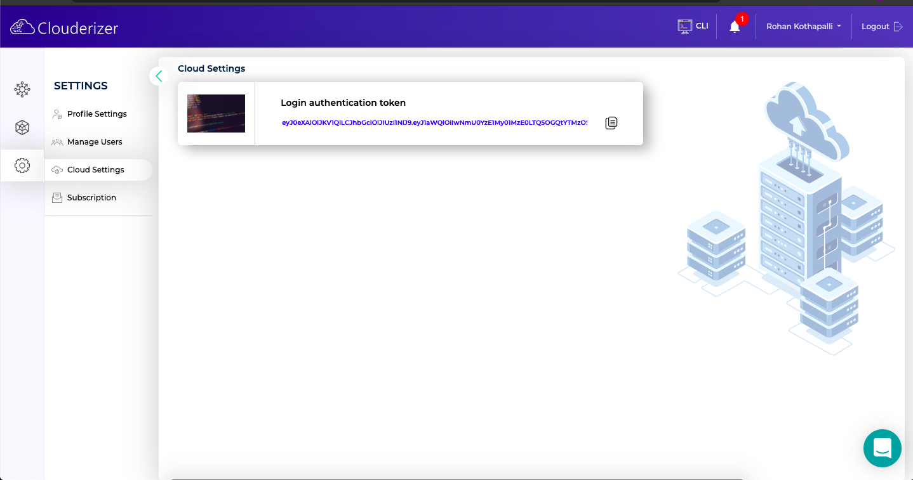
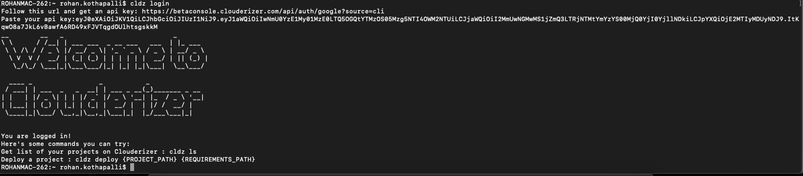

Clouderizer offers a python based CLI for creating, deploying and managing its projects.

#### Pre-requisites

1. System running MacOS / Ubuntu / Windows (with WSL)
2. bash / sh / zsh terminal
3. Python 3+
4. Pip for python3

#### Steps

* Install Clouderizer CLI by running the following command in the terminal
```
pip install clouderizer
```
 

* Open a new terminal session for the changes to take effect. To test if cli was installed, type ```cldz```. The cldz help section similar to the below image should show up.

 

* To use cli you need to be a Clouderizer user, ```cldz login``` is the command to authenticate yourself.

Once ```cldz login``` is executed, 

--> a browser window will open(if browser does not open, manually open the link as seen in image below). 

 

--> Follow the Google authentication work flow to get yourself loggedin. If your are an existing user select the google account you are using with clouderizer. New users will be automatically signed up with Clouderizer via the same process.

--> After completing the google flow, you are now logged in with clouderizer and redirected to cli login authentication token page. 

 

--> Copy the token and paste in the terminal.

On successful login you should see the terminal output similar to below image.

 

Cli is successfully setup and you are logged in.