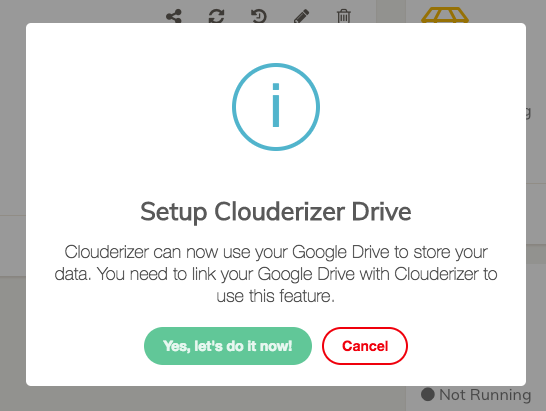
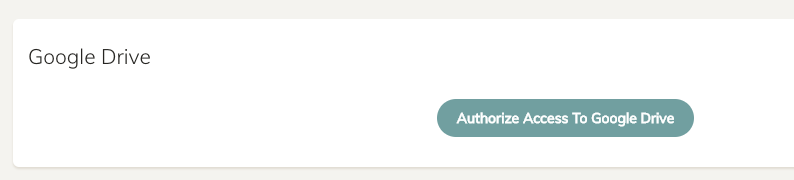
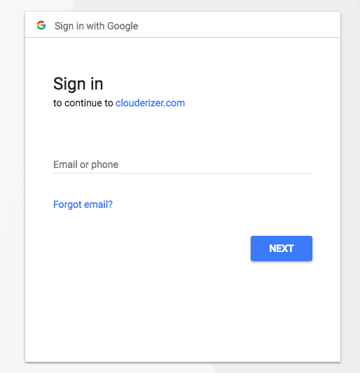
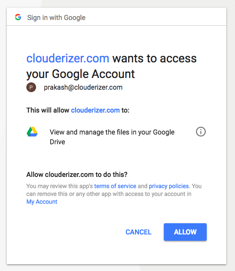
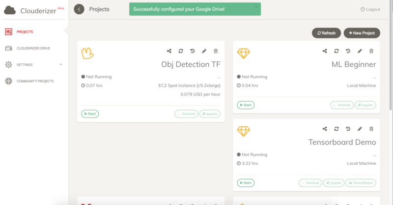

Once you login to your console, you should now see a prompt to link your Clouderizer account to Google Drive.

*Prompt to link Google Drive account with Clouderizer*  
Alternatively, you can also go to Settings->Cloud Settings, and press “Authorize Access to Google Drive”

*Cloud Settings for linking Google Drive account with Clouderizer*  
Once you click this, it will take you to Google Login screen. Here you should login with the Google Account that you wish to link.

  
Once you login, you will be presented with Authorization screen from Google as below

*Authorization Screen to allow Clouderizer Google Drive access*  
!!! tip "Note" 
    This access is needed to make sure Clouderizer is able to offer 2-way sync between your Google Drive and machine where your projects are running. We don’t use this access for any other purposes. At any point of time, you can go to Cloud Settings on Clouderizer console and revoke Google Drive access. You can revoke access directly from your Google Account settings here as well. In case you are still not comfortable giving API access from your Google Drive account, you can always signup and setup a fresh Google Account only for using with Clouderizer.

Click “Allow” here. This should now take you back to Clouderizer console and you should see a success notification indicating that Google Drive integration was successful.

*Google Drive successfully configured*  
Done. Your Google Drive will now show a new folder clouderizer

Any new project that you create now, will automatically create a new sub-folder inside this. And all project folders will have code / data / out sub-folders as well, that correspond to code / data / out folders of your Clouderizer project.
[Here]() is an article that explains about these folders and how 2-way sync works between your machine and Clouderizer Drive.

For our existing users, who have projects created before Google Drive integration, next time you run your project, its folder will automatically appear on Google Drive. And in case you don’t see any data or out folder for your projects, you can always create them manually on Google Drive and upload data in them. They will automatically sync with your machine once you run your projects.
    