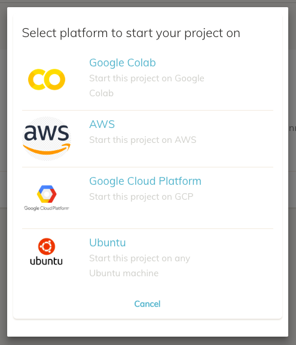
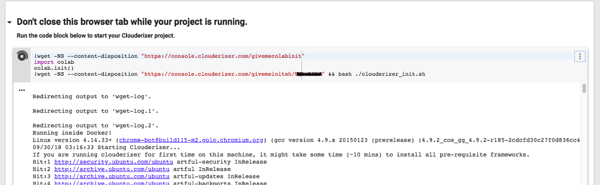
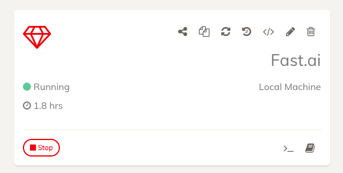

Below are the steps to setup fast.ai course notebooks on Google Colab.

Following pre-requisite, one time, steps are needed.

* Sign up and request access to Google Colab.
* Sign up for Clouderizer.
* Login to Clouderizer console. On first login, you will be prompted to link your Google Drive with Clouderizer. Follow on-screen instructions to do so.
* Now from Clouderizer console, go to Community Projects. Search for fast.ai template and clone it.
* On project wizard, select default options on all screens and save.  

Now every time you need to start fast.ai notebooks on google colab GPU, follow below 2 steps

* From Clouderizer console, press Start on fast.ai project created earlier. This will ask you to select the platform where you wish to run this project. Select “Google Colab” here. 

*Select Google Colab as Platform to start*

This should create a Colab notebook for your project. Press “Launch Notebook Now”. This will open the Colab notebook in a new tab.  

* Run the code block in Colab notebook.

*Starting the project on Colab notebook*  
Thats it! This will trigger an automated fast.ai course environment setup, latest code download and dogscats dataset download. You can go back to Clouderizer console and track the progress of this setup. Once setup is complete, project status becomes Running and Jupyter Notebook button becomes available. Clicking on Jupyter button, will open Jupyter notebook with fast.ai github code.

*Project Started*  

!!! danger "IMPORTANT NOTE"
    In case while working on JupyterLab or remote terminal, you get 502 Gateway Error, this is due to Colab instance getting terminated behind the scene. Please note that Google Colab instances are volatile. They get terminated every 12 hours, or can get terminated much sooner in case of high demand and idle sessions.

While your Clouderizer project is running on Colab notebook, make sure you don’t close Colab notebook tab. Preferably, keep it in foreground on one of your secondary displays. This helps in preventing pre-mature shutdown of Colab instance.