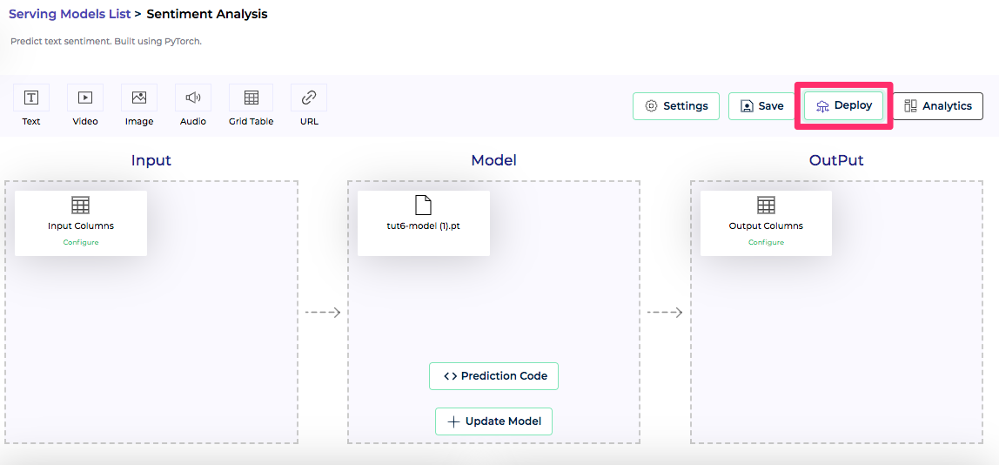
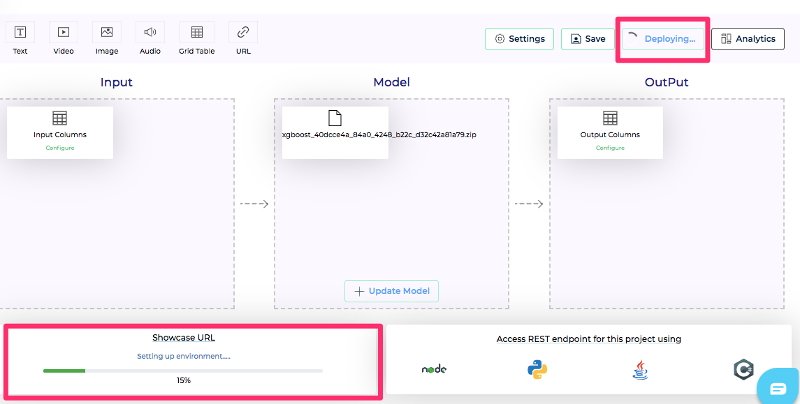
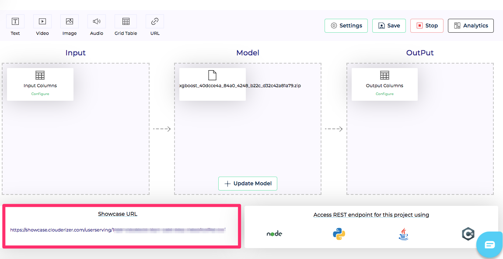

Once clouderizer project is created and fully configured, we are all set for deployment. We can trigger deployment from CLI or from our web console. For CLI instructions please refer [here](../cli/deploy.md)

For deploying from web console, go to your project page and press the Deploy button on top right.

*Figure 1 - Deploy model button* 

Following deployment options are available

1. Standard Memory config - 2GB Memory
2. High Memory config - 6GB Memory
3. GPU Config - 16GB GPU Memory, 30GB System Memory

Select the desired infra option and press OK.

This will trigger start the deployment process, where your project is bundled in a container and pushed on Clouderizer Serverless infrastructure.

### Deployment Status

Once deployment is started using any of the methods above, status on the project page updates to indicate deployment is in progress. We can see details about the progress from bottom left portion of screen.

*Figure 8 - Deployment in progress* 

When deployment is complete, status changes to Running state and we can see deployed project's URL in the bottom left portion of screen. This URL can be used for invoking the serverless endpoint. More details on scoring can be found [**here**](./scoremodels/scoringui/introduction.md) and [**here**](./scoremodels/restfulapis.md).

*Figure 9 - Deployment complete* 

### Scalable Serverless Deployment

Clouderizer offers a scalable serverless infrastructure, which means it auto scales your deployment to multiple replicas and nodes in case of high load and it auto scales down to 0 in case of no traffic. Billing for Clouderizer infra is per-second execution time, which significantly saves on idle capacity charges.

