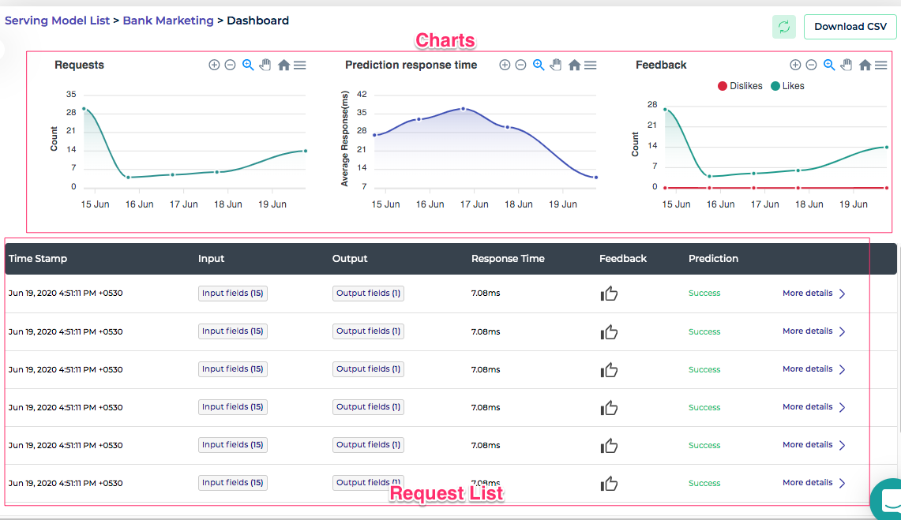
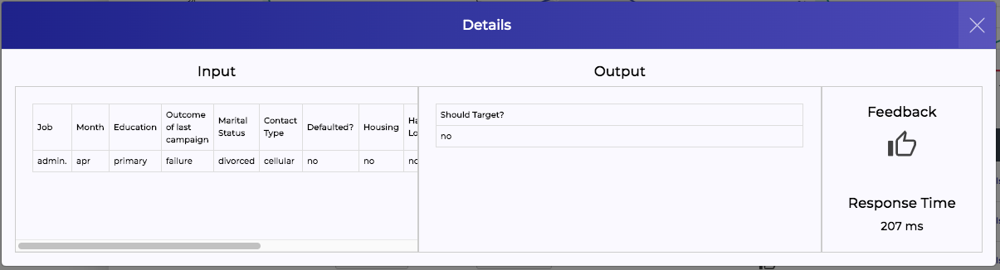
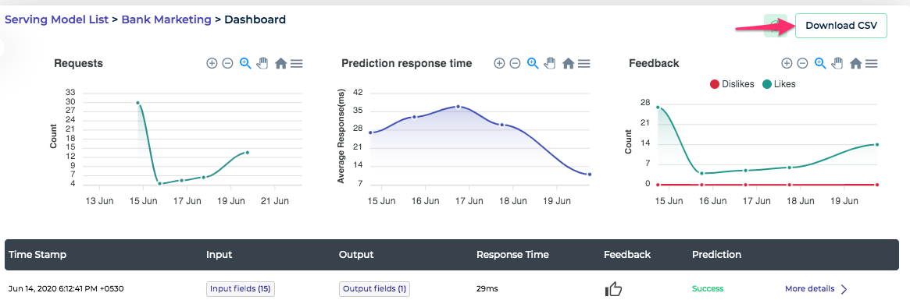

*Figure 1 - Analytics* 

Clouderizer Showcase offers an analytics dashboard to monitor deployed model performance and other statistics. This dashboard can be accessed from **Analytics** button from Showcase project page. Analytics Dashboard offers following

### Charts

Top of the Analytics dashboard shows statistical charts showing historical trends. 

#### Request Count

This shows rate of requests hitting Showcase project deployment server. This is a good indicator for monitoring request traffic hitting the model server.

#### Prediction Response Time

This shows trend for average response time taken by the model to make prediction. It is a good indicator for monitoring model compute performance.

#### Feedback

This shows trend for positive and negative feedback from users or integrated applications for model prediction. This again is a good indicator to keep a track on model performance and detect any deterioration in model accuracy.

### Historical Request List

Showcase stores each requests hitting the model server in a scalable time series storage. This list is available to us from Analytics dashboard. Important columns from this list are

1. Timestamp - Time of request
2. Response Time - Time taken for model to make prediction
3. Feedback - User feedback on the model prediction
4. Prediction - whether prediction was done successfully or not. In case some error occured in making the prediction, this staus changes to Error.

#### View Request Details

*Figure 2 - View Request Details* 

Clicking on *More details* button on individual row from the list, shows the details of input parameters sent for the request and corresponding output scored by the model.

#### Download CSV

*Figure 3 - Download CSV* 

The historical request list can be downloaded as a CSV using the **Download CSV** button on the top right corner of the Analytics page. This is very useful to prepare an addendum to the labelled dataset for re-training the model.