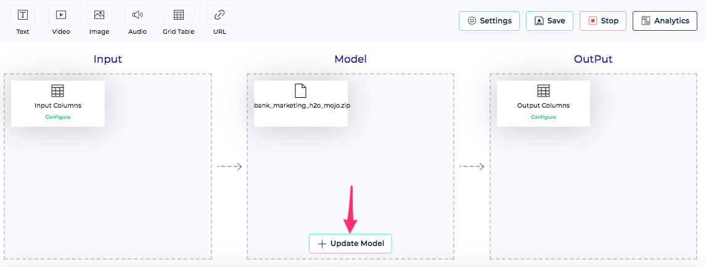

Model projects can be updated with new model files, preprocessing, prediction, post processing code, at any time, even if they are currently deployed and live. Clouderizer ensures rolling update with neglegible downtime.

!!! tip
      For CLI instructions for updating models in a deployment, please refer [here](../../cli/update.md)

### Updating Model File

*Figure 1 - Update Model File* 

Model file can be uploaded using **Update Model** button on the Showcase project page under Model block.

### Updating Pre-processing Code

Pre-processing code can be updated any time by going to the code editor using **Pre-processing Code** button under Pre-processing block. We can make our changes, test them by running it. Once finalized, we should **Save** and **Upload** the updated pre-processing code. Project needs to be re-deployed for the new changes to take effect.

### Updating Prediction Code

Prediction code can be updated any time by going to the code editor using **Prediction Code** button under Model block. We can make our changes, test them by running it. Once finalized, we should **Save** and **Upload** the updated prediction code. Project needs to be re-deployed for the new changes to take effect.
