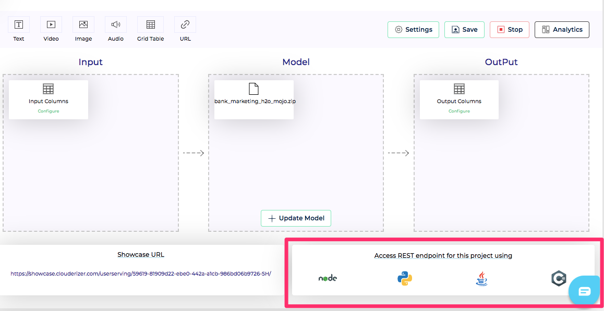

Once Showcase project is deployed successfully, Clouderizer exposes REST endpoints for it. These REST endpoints can be called by any external application to score their data using this model.

REST endpoint URL is available in the bottom left screen of a running project


*Figure 1 - REST Enpoint URL*<br/>


## Notebooks

#### Async Endpoints

Notebook deployments support Async serverless endpoints. This is useful as often Notebook execution is a long running operation. Async endpoints can be invoked via any http client like curl. Caller can specify a callback URL (webhook) in its http invocation using http header ```X-callback-url```. Serverless function immediately replies back with 202 request accepted response code and continue to execute the notebook. Once notebook execution is complete, the callback URL (webhook) is called with the result. In addition to this webhook, output of the invocation can also be viewed under **Invocation History** on Clouderizer console.

## Models
Following are the handlers available model deployment REST endpoint

### /predict
This is the api which allows any external application to submit input and get back scored output. Showcase console offers sample code for invoking this handler in Node.js, Python, Java and C#.

*Figure 2 - REST Sample Code*<br/>
#### Method Type
POST
#### Input Payload

Model input need to be submitted as a form payload with field name csv. Value of this field should be a comman separated values of all model inputs (order of inputs should be exactly same as order defined in Model project page)

#### Output Payload

Following is the convention for output for various data types

##### Integer, Whole and Text

Output is an array of all output variables defined in Model project page under Output.

{"<output1>":<output1_value>,..., "responseTime":"<time in ms>", "success":"true"}

##### Enums

Enum outputs are returned in json format with following schema

{"label":<output>, "classprobabilities":[<Enum1_probability>, <Enum2_probability>,...], "responseTime":"<time in ms>", "success","<true/false>"}

#### Errors

### /feedback
This is the api using which an external application or end user can give feedback about the model performance.
#### Method Type
POST
#### Input Payload

#### Output Payload

#### Errors

