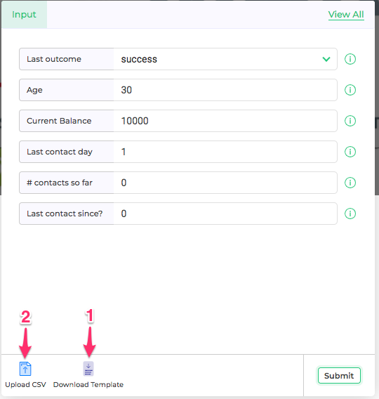
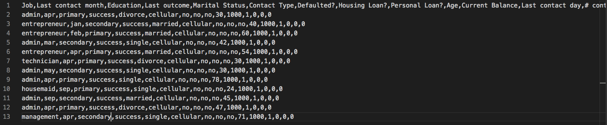
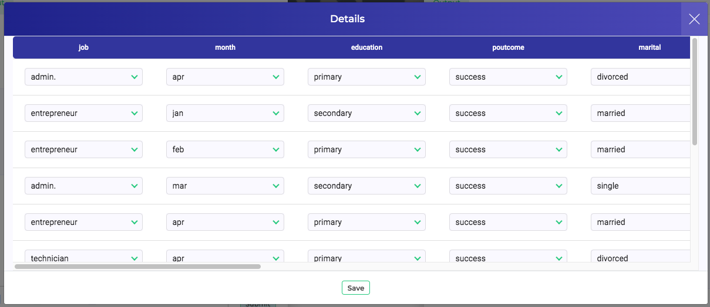
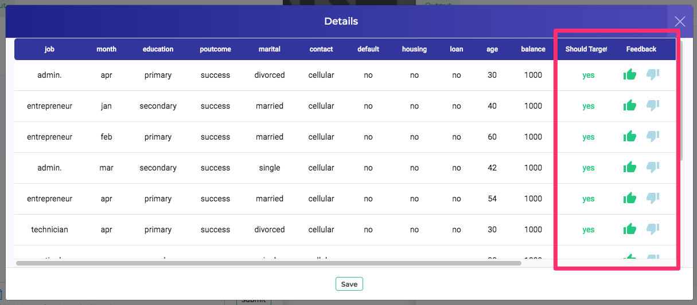

*Figure 1 - Download CSV Template* 

In case we wish to make bulk predictions on our model, Scoring UI gives a very easy to use and intuitive interface to do that. Testers or users need not write any code or draft curl commands. They can just upload a CSV with a list of inputs and get back the output in one shot.

*Figure 2 - Editing CSV* 

We can download a template CSV by pressing button #1 from Fig.1 above. This csv can be opened and edited in any text editor or spreadsheet editor. It contains the header rows. We can now insert rows of input data, save the file and upload it using the button #2 in Fig. 1 above.  

*Figure 3 - Review Inputs* 

Once uploaded, showcase allows us to review the bulk input rows and make corrections if needed. Press Save once all review changes are done. And then press Submit to trigger bulk prediction on this data. This will send this batch request to the deployed Showcase project, predict each individual rows from the project model and return back the scored data.

Once output is ready, we can press View Results to view them.

*Figure 4 - View Results* 

This opens up the list view with all input rows. All output columns are appended at the end. There is one additional column for feedback. User can give thumbs up or down for the individual line predictions here.