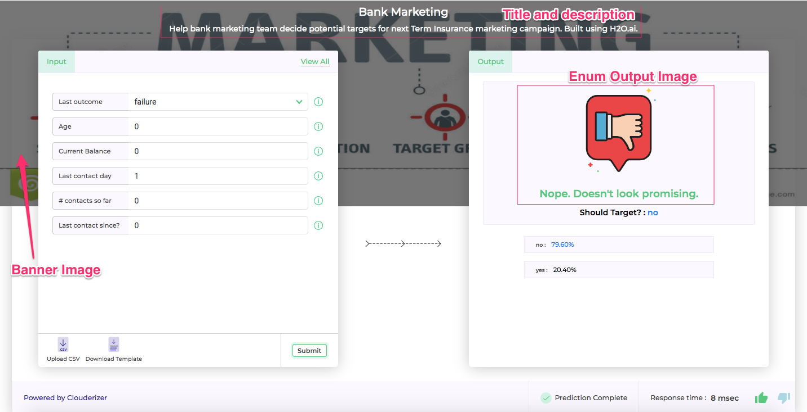
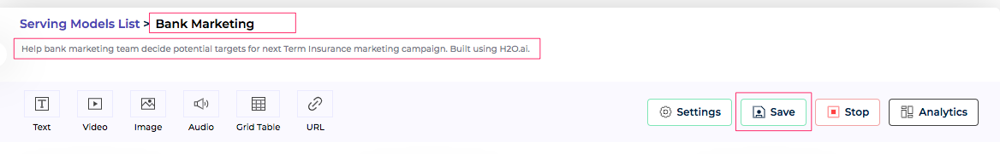
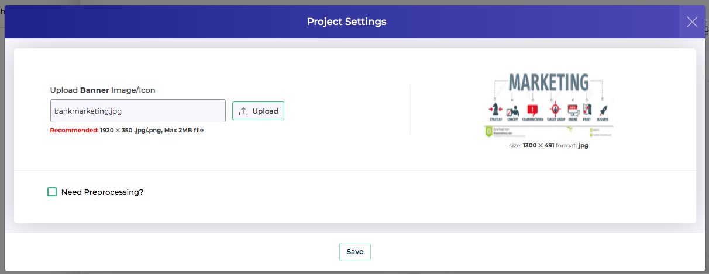
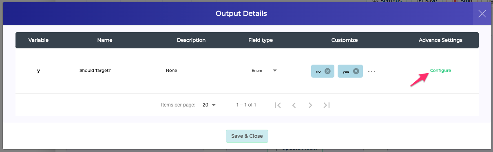
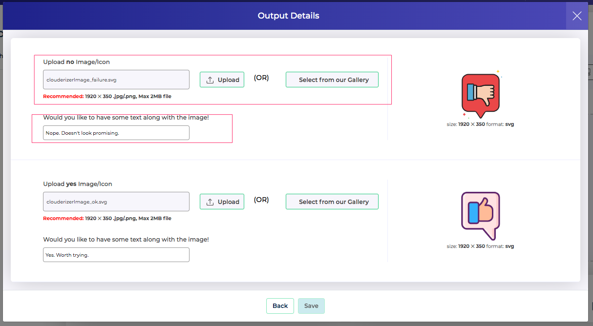

*Figure 1 - Scoring UI Customization Elements* 

Showcase offers following customization and branding options for the Scoring UI

### Title and Description

*Figure 2 - Scoring UI Title & Description* 

Project title and description can be configured from Showcase project page. Clicking on the Title name allows to modify it. Similarly clicking on the description text, allows us to modify it. Once modified, we can press Save button to commit it.

### Banner Image

*Figure 3 - Scoring UI Banner Image* 

Banner image can be updated from Project page -> Settings. We can upload and save the banner image. 

### Enum Output Images

*Figure 4 - Scoring UI Output Icons* 

*Figure 5 - Scoring UI Output Icons* 

Output on the Scoring UI can be complimented with intuitive icons / images / gifs to offer an impressive presentation. This can be configured from Showcase project page -> Output -> Configure. All output variables of type Enums have an additional button *Configure* in their row (Fig 4). Pressing configure, gives option to select an image and specify a text (punch line) for each Enum state (Fig 5). Images can be either uploaded or selected from a builtin gallery. Once configured, save the setting.

All the above customization options, once configured, get loaded by Scoring UI on next browser refresh.