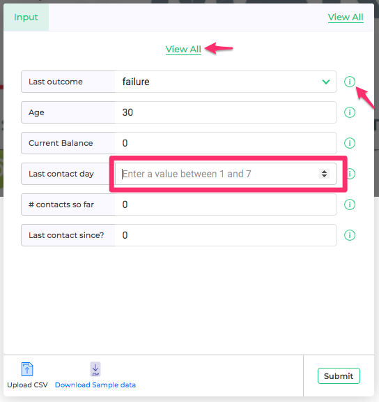
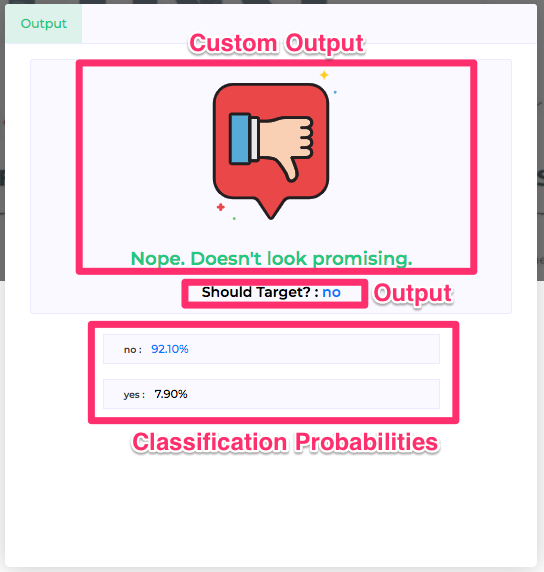
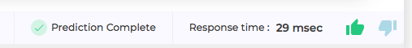

Most simplistic way to use Scoring UI is to use the input form. 

### Input
Scoring UI dynamically generates input form based on raw inputs defined in Showcase project. 

*Figure 1 - Sample Input Form* 

Form is equipped to handle input validation like integer ranges, enum types, etc, as defined in the Showcase project. Also description for each input field is available as a tool tip to the "i" icon at the end of every form line.

In case user has marked few input fields as important, Scoring UI presents just the important fields. This is particularly useful for models which have large number of inputs. Limiting the form to just the most important fields makes it easy for anyone to try out the model. In case someone wishes to input all the fields, one can toggle to "View All" view from top right corner of the form.

### Output
Once input form is submitted, Scoring UI calls the RESTful API /predict for the Showcase project to get back the prediction. Output from the REST endpoint is displayed on the right portion of Scoring UI.

*Figure 2 - Sample Output* 

Output as defined under Showcase project is displayed under section "Output" in figure above.

For classification models, class probabilities are also displayed as shown in Fig 2.

To make output realistic and user friendly, we can define icons, images, gifs for enum outputs along with some custom messages. Details about how to configure these custom outputs can be found [here](customizations.md)

### Feedback

*Figure 3 - Sample Feedback* 

Along with output variables, Scoring UI also displays *Response Time* taken by the model to make the prediction. This is a good indicator about how efficiently model as well as the infrastructure where model is deployed, is performing. Users or testers can also give feedback with a thumbs up or thumbs down, for how they feel about the output. This helps build up feedback analytics about model performance. More details about model monitoring and analytics can be found [here](../../managemodels/monitormodels.md)

