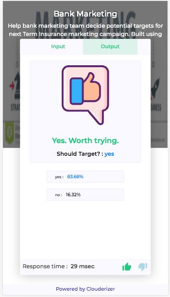

Clouderizer Showcase offers an out of box, autogenerated **Scoring UI** for all deployed models. It is a modern web interface which allows anyone to feed in model inputs and get back scored output. It also allows users to give feedback about how they feel model is performing. This is an excellent tool for 

* Testing and Validation of model from external teams
* Showcasing model to clients, beta customers, senior management
* Playing around with model

*Figure 1 - Sample Scoring UI* 

Scoring UI is built on top of modern web interface technology. Its fully responsive and works well on both desktop and mobiles.

*Figure 2 - Scoring UI on mobile* 

Scoring UI endpoint can be made public, such that it can be shared with people who don't have Clouderizer account.

Base URL for project REST endpoint loads this application. Easiest way to access it would be to click on the URL on the bottom left screen of running Showcase project.

