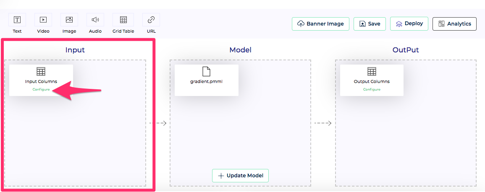
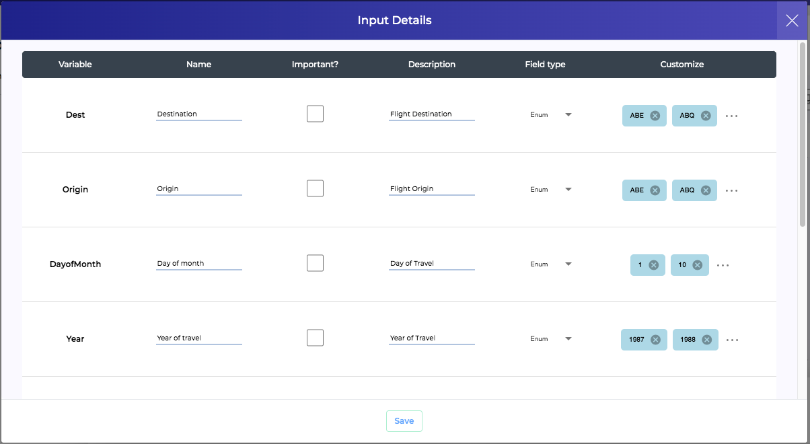
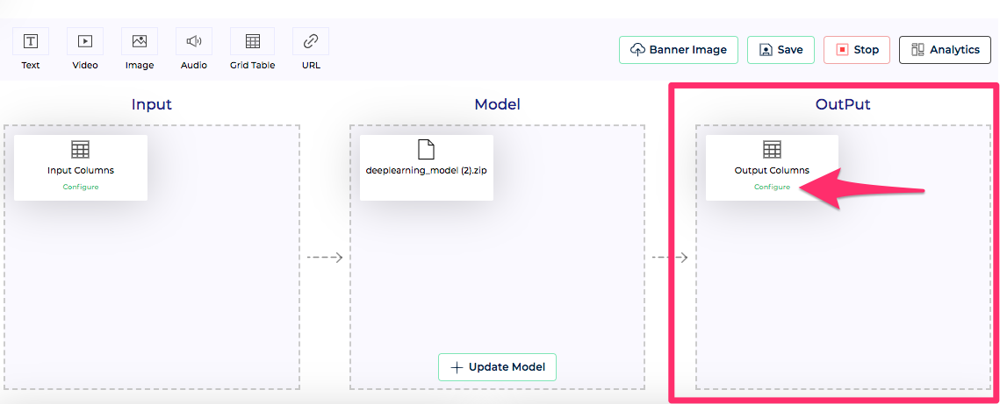
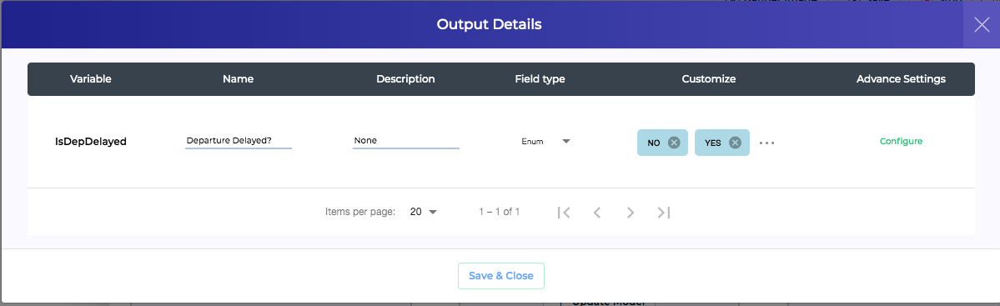

Once Showcase project is created Showcase project offers following configurations

```
Note: This configuration does not apply for Notebook project type.
```

### Input
<br/>
Every ML model requires input, using which it generates output. **Input** is represented by first block in Showcase project workflow. For MOJO and PMML projects, Showcase parses the model and automatically extracts and pre-configures model inputs. For Python models, this needs to be specified explicitly. At any point of time, we can modify model inputs by pressing the *Configure* button inside input block.

<br/>

Input configuration allows us to specify various input items for the model. In case of MOJO and PMML, model input line items are auto derived from model file and cannot be added/removed. But we can alter certain properties of model input line items. Each input line item has following properties
  
  1. **Variable** - This is the name which model actually recognises. In case of H2O and PMML, this is burnt in model and is a read only field. This property is used in Showcase input validation. In case a scoring request comes with a missing input or a mis-spelt input, request is rejected with Validation error.
  2. **Name** - This is a user friendly name for the model input item. We can specify whatever we want. This is the name shown to end user on [Scoring UI](../scoremodels/scoringui/introduction.md).
  3. **Important** - This allows user to specify if this particular input is important. If some fields are marked as important, Scoring UI automatically shows only important inputs on first load. Users can press *View All* to see all inputs. It is useful for models that have large number of inputs and we want to make it easy of people to test the model with important inputs using Scoring UI.
  4. **Description** - This is again used for Scoring UI. Users testing the model via Scoring UI, can see this description to know more about this input.
  5. **Field Type** - User can specify field to be one of the following types

    * Text
    * Multi Line Text
    * Enum
    * Integer
    * Number

    This property is used in Showcase input validation. In case a socoring request comes with inputs not following the type specified, request is rejected with Validation error. This property is also used to design input form for Socring UI.

  6. **Customize** - This property is used to add more validation rules for inputs. Enum categories can be defined for Enum input types. For integer/number input types, we can specify the range within which input should fall. This property is also used for input validation and for designing input form for Scoring UI.

### Output
<br/>
**Output** from the model, is represented by the last block in Showcase project workflow. For MOJO and PMML projects, Showcase parses the model and automatically extracts and pre-configures model output. For Python models, this needs to be specified explicitly. At any point of time, we can modify model output schema by pressing the *Configure* button inside output block.

<br/>

Output configuration allows us to specify various output elements for the model. In case of MOJO and PMML, model output line items are auto derived from model file and cannot be added/removed. But we can alter certain properties of model output line items. Output line item properties are similar to Input line item properties described above. We have an additional column for *Advanced Settings* in output. Details about this setting is covered under [customizations for Scoring UI](../scoremodels/scoringui/customizations.md).


