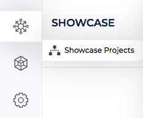
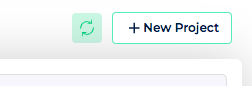
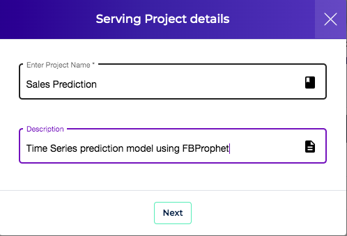
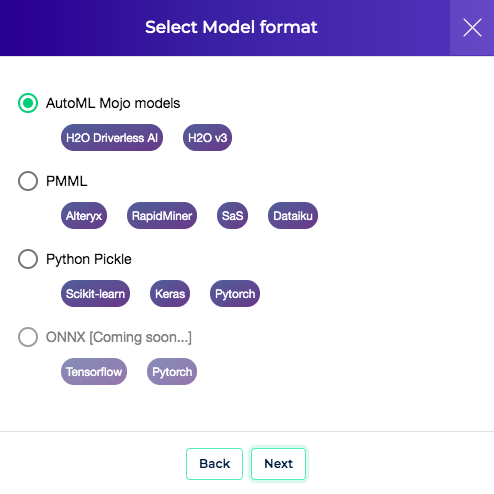
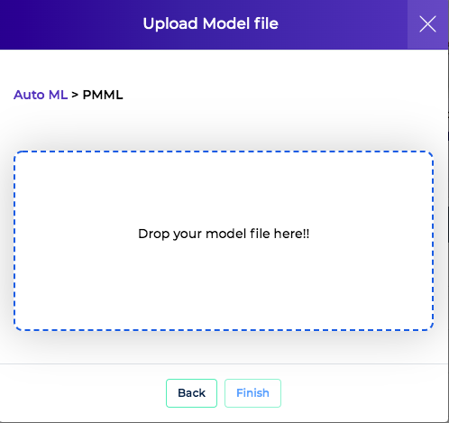

Clouderizer Projects are created using model files (ONNX or MOJO or PMML or pickle) or Jupyter Notebooks. 

### Upload Jupyter Notebook

It is assumed you have a perfectly running Jupyter Notebook with you. This notebook can be about anything from Data Exploration, Data visualization, Data analysis, Model Training, Prediction, Model Scoring. Once deployed, notebook serverless endpoint can be invoked to run on CPU or GPU any number of times with different input parameters. This allows to design and deploy robust, cost-effective and scalable MLOps stages. Clouderizer stores executed Notebook and any output files generated from Notebook execution as an artifact. Notebook deployment can be updated with newer version of notebooks as well.

For CLI based instruction for creating a notebook project please refer [here](../../cli/deploy.md).

1.  Goto **Showcase Tab**
  
     

2.  Press **New Project**
  
     

3.  Give project a name and description and select **Notebook** as project type. Press **Next**

4.  Drag and Drop the notebook file from your computer. In case your project requires specific libraries, list them in a requirements.txt file and upload that as well. Press **Finish**

This should trigger start your project creation. Once project is created, it is ready to be deployed to different kind of infrastructure. Please refer [this](../deploymodels.md) for deployment instructions.

### Upload Model

It is assumed you have successfully exported your ML/DL model to a model file and have it available with you on your computer.These become first version of models for the project. Once created, these projects can be deployed, scored and monitored. Later, when needed, models inside a project can be updated as well.

To create a project

1.  Goto **Showcase Tab**
  
     

2.  Press **New Project**
  
     

3.  Give project a name and description and press **Next**
  
     

4.  Select the model type that you wish to upload and press **Next**. Supported model types are MOJO, PMML and Python pickle files.
  
     

5.  Drag and Drop the model file from your computer and press **Finish**
  
     

This should trigger start your project creation. Behind scenes, Showcase will upload your model, parse the model to get input / output parameters (only for MOJO and PMML models). Once project gets created, it will offer you to have a look at the detected model input parameters. More information about configuring model input/output parameters can be found [here](configure.md)

