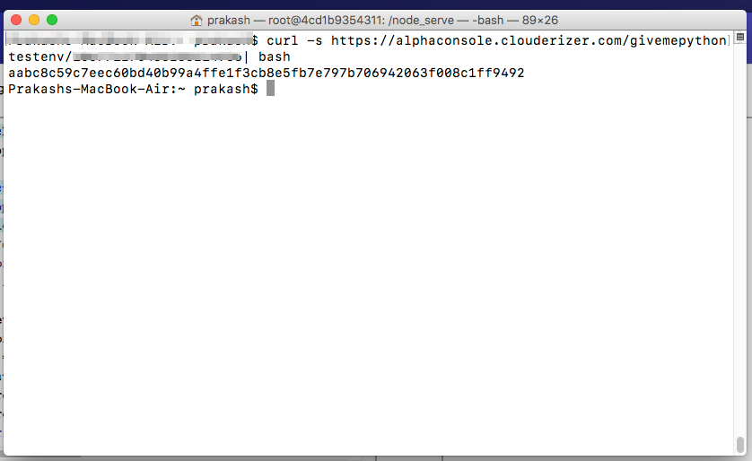

Clouderizer Showcase allows us to test our preprocessing, prediction and postprocessing code in the console itself. This testing requires a debugging env setup on your local machine. 

Pre-requisites

* Linux or Mac machines with Docker installed and running.
* Min. 4GB of RAM

Lets go over the steps needed for this setup.

1. Open your Showcase project and launch code editor for any of your pre-processing or prediction block.

*Figure 1 - Prediction code button* 

2. First time, you see following message at the top of code editor window.

*Figure 2 - Setup instructions* 

3. Copy the curl command by pressing the copy button at the end of text box.

*Figure 3 - Copy command* 

4. Open a terminal on your machine and paste the command copied above and press Enter.

*Figure 4 - Run on terminal* 

5. This should start the dev docker env on your machine. Once docker is up and running, switch back to Showcase console code editor view. It should detect the dev environment and show **Connected to Kernel**

*Figure 5 - Connected to kernel* 

6. You can now test your code by pressing Run button. Output should appear on the right.

7. In case you have added some dependency pip package to your pre-process or prediction code, and want to install the same package in your debugging env as well, press the install button on the right of pip packages text list. You can see the progress of package installation from the output view.

*Figure 6 - Install dependencies* 
