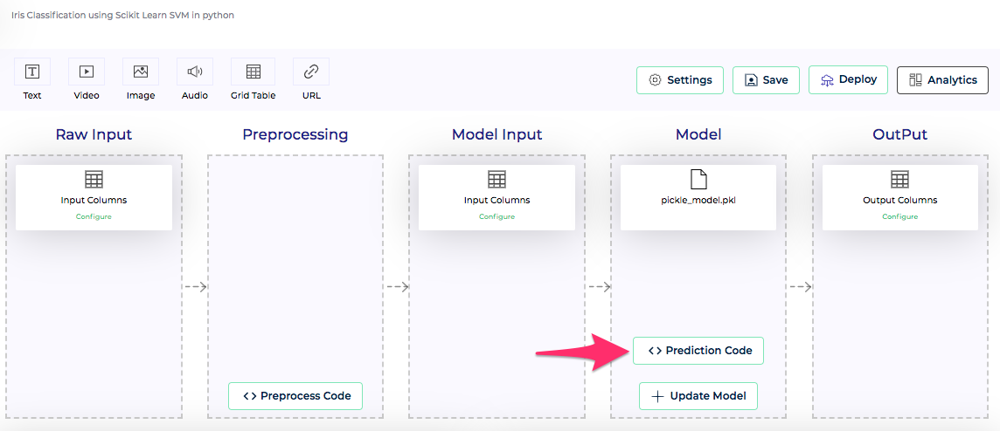

Once we create the project and configure its inputs and outputs, we are all set. PMML and MOJO projects are completely code-less. Which means we don't need to specify any code to deploy these models. Clouderizer's PMML and MOJO scoring engine takes care of that.

In case of Python projects, users need to provide a prediction code snippet, which uses the python pickle file and performs prediction. Showcase takes this snippet and integrates it with the deployment pipeline, offering end to end robust, scalable, secure, manageable deployment.

*Figure 1 - Prediction code button* 

To configure the prediction code, press **Prediction Code** button under Model block. This brings up console code editor.

#### Code

*Figure 2 - Prediction code* 
Code editor scaffolds a *predict* python function that needs to be filled up. Input to this function is a python object **data**, an array containing model inputs. Scaffoled code also includes lines which loads the model pickle file and offers it as a python object. We need to paste our prediction code inside the predict function. Output from this function needs to be another array matching schema for model output.

We are free to include any other helper code outside the predict function like importing other libs, defining other functions and classes, declaring and initializing global variables, etc. 

#### Libs

*Figure 3 - Configure preprocess libs* 
In case your pre-processing code requires other python libraries, you can add your dependency packages here. Go to the text field at the bottom of code editor, which says *Add pip packages*, type in your pip package name and press Enter. Add as many packages as you want. Make sure to press Save button to ensure these dependency packages list is saved.

#### Test

*Figure 4 - Test preprocess code* 
Clouderizer console allows us to test our code within the code editor itself. It requires us to get debugging setup. Please follow instructions [**here**](debuggingsetup.md) to set this up. Once your setup is proper, code editor shows *Connected to Kernel* message on top left. Once our code editor shows that it is connected to kernel, we can press **Run** button at bottom of the code editor to run the code. Make sure you fill the input data object with some dummy input data for testing. Output shall appear on the right under Output. Once you are satisfied with your pre-processing code, press Save and Upload button to save it.

!!! tip
    Make sure to press Save button as you are modifying your code and dependency package list to ensure your changes are saved.
