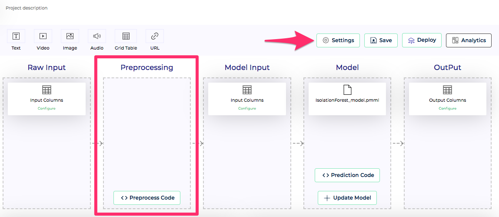
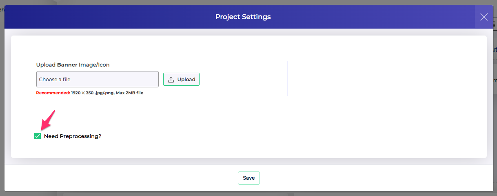
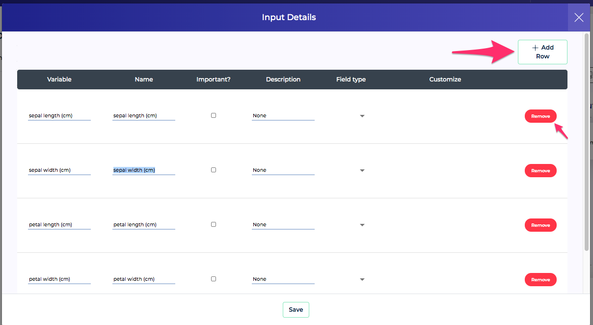
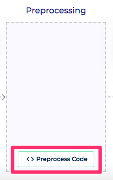
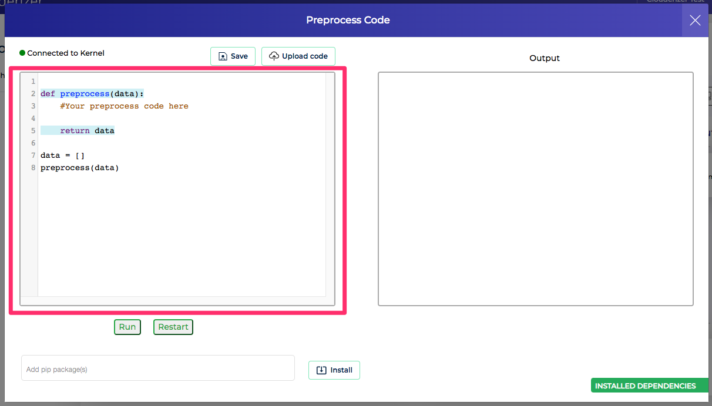
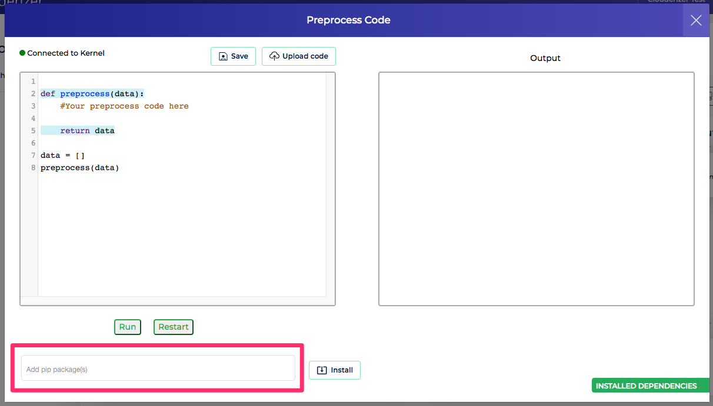
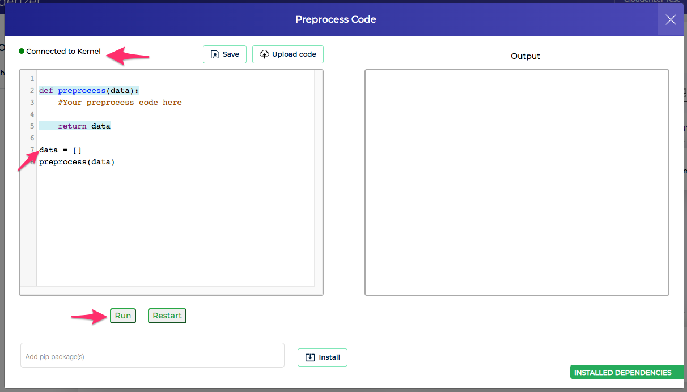
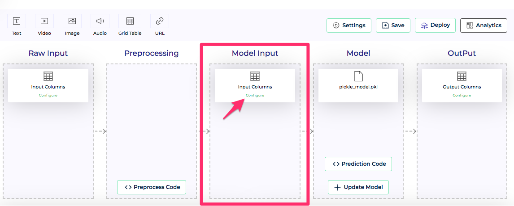

We can enable pre-processing on user input before we feed it into the model for evaluation.

```
Note: This configuration does not apply for Notebook project type.
```


*Figure 1 - Pre-processing workflow*<br/>

Preprocessing can be enabled by going into Showcase project Settings and enabling option **Need Preprocessing**


*Figure 2 - Enable pre-processing*<br/>

Once pre-processing is enabled, project pipleline workflow changes as per Figure 1 above. Two new blocks get added before Model Input
### Raw Input

*Figure 3 - Raw input configuration*<br/>

This is the main input to the project. Raw input is completely defined by user. We can press Configure on Raw input block to bring up its configuration. Here we can add / remove input line items and configure its Name, Description, Type, Enum types, ranges, etc.


### Preprocessing

*Figure 4 - Configure preprocess code*<br/>

We can specify pre-processing python code that transforms raw input into a form that can be consumed by our model. Press **Preprocess Code** button on Preprocessing block to open the code editor.

#### Code

*Figure 5 - Configure preprocess code*<br/>
Code editor scaffolds a *preprocess* python function that needs to be filled up. Input to this function is a python object **data**, an array containing raw inputs. We need to paste our pre-processing code inside the predict function. Output from this function needs to be another array which will be input into the model.

We are free to include any other helper code outside the preprocess function like importing other libs, defining other functions and classes, declaring and initializing global variables, etc. 

#### Libs

*Figure 6 - Configure preprocess libs*<br/>
In case your pre-processing code requires other python libraries, you can add them here. Go to the text field at the bottom of code editor, which says *Add pip packages*, type in your pip package name and press Enter. Add as many packages as you want. Make sure to press Save button to ensure these dependency packages list is saved.

#### Test

*Figure 7 - Test preprocess code*<br/>
Clouderizer console allows us to test our code within the code editor itself. It requires us to get debugging setup. Please follow instructions [**here**](debuggingsetup.md) to set this up. Once your setup is proper, code editor shows *Connected to Kernel* message on top left. Once our code editor shows that it is connected to kernel, we can press **Run** button at bottom of the code editor to run the code. Make sure you fill the input data object with some dummy raw input data for testing. Output shall appear on the right under Output. Once you are satisfied with your pre-processing code, press Save and Upload button to save it.

!!! tip
    Make sure to press Save button as you are modifying your code and dependency package list to ensure your changes are saved.

### Model Input

*Figure 8 - Model input*<br/>
Model input is what is fed to model for scoring. Output from preprocess code (what we return from preprocess function above) should be in the format of model input scheam. We can press *Configure* button on model input block to access its configuration. In case of PMML and MOJO projects, model input line items are fixed and read only. We can just modify its name, description and field types if needed. In case of Python projects, complete model input schema is configurable. We can add / remove input line items as per our project specifications. Model input schema is used in Showcase input validation. Which means if our pre-process code is not able to produce output as defined in model input config here, request fails input validation.