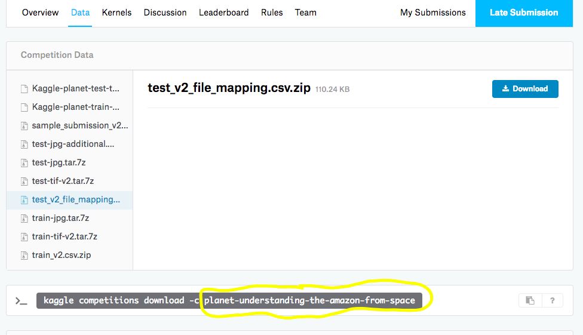

Clouderizer has integration with official Kaggle API. In order to use this integration, following one time activity needs to be performed.

Login to your Kaggle account and go to My Account -> API and Create New API Token. This will download your API token file, kaggle.json, on your machine.
Now login to your Clouderizer console and go to Settings -> Cloud Setting -> Kaggle Credentials. Choose kaggle.json file downloaded in step 1 and press Upload Kaggle Credentials.

*Note: These credentials are stored in our secure database and are only pushed and used on machines you run your Clouderizer projects on. At any point of time, you can revoke/expire these credentials by logging into your Kaggle Account and going to My Account -> API -> Expire API Token.*  
Once above steps are done, every time you create / edit a project, a new option should appear under WORKSPACE tab, Kaggle Datasets.

Here you can specify any Kaggle competition or dataset name, which you wish to automatically download once project starts. You can get this name from Data tab of any Kaggle competition page e.g.

*Note that you can specify more than one Kaggle dataset in a single Clouderizer project. Just type or paste the name of dataset and press enter. This should allow you to add more datasets*

Make sure you have accepted the Rules for the competition from Rules tab. Failing to do so, will prevent Clouderizer from downloading the dataset.

Once you have saved the Clouderizer project with required Kaggle competition/dataset names, you can start this project on any machine of your choice. On start, Clouderizer will automatically download the specified dataset from Kaggle site and save them on data folder of clouderizer project. Inside data folder, we create two sub folders competitions and datasets. These folders further contain subfolders for various competitions and datasets specified in project setup.

These datasets are backed up in Google Drive as a zip archive under your project folder. Any changes made to the dataset are also saved to Google Drive.

This is very useful in automating the dataset download especially on instances like Google Colab, where transferring data and Kaggle credential files is not straight forward.