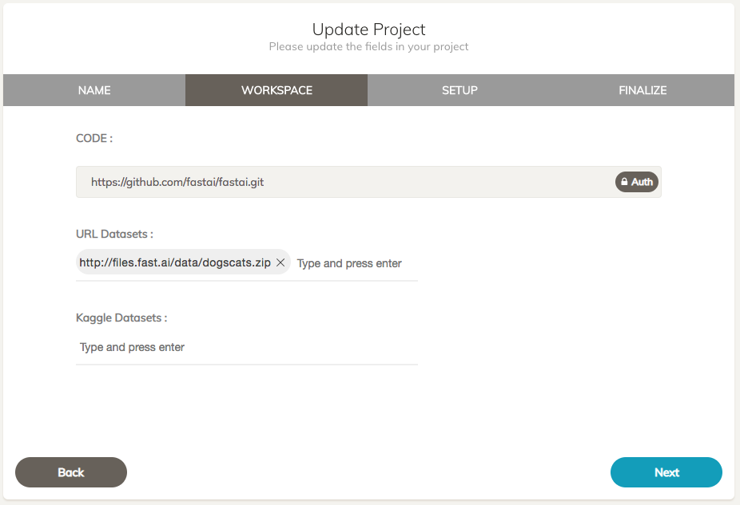

You can configure to automatically download datasets from any URL on project start. Following are the steps

Login to your Clouderizer console.
Create a new project or modify an existing project and go to WORKSPACE tab.
Here you can specify full http URL of the dataset and press enter to add it to dataset list.  

  
You can specify more than one dataset if needed.

Once you have saved the Clouderizer project with required dataset url, you can start this project on any machine of your choice. On start, Clouderizer will automatically download the specified dataset from Kaggle site and save them on data folder of clouderizer project. In case of zip or tar dataset, Clouderizer will automatically extract it and place it inside /data folder of the project.

These datasets are backed up in Google Drive as a zip archive under your project folder. Any changes made to the dataset are also saved to Google Drive.