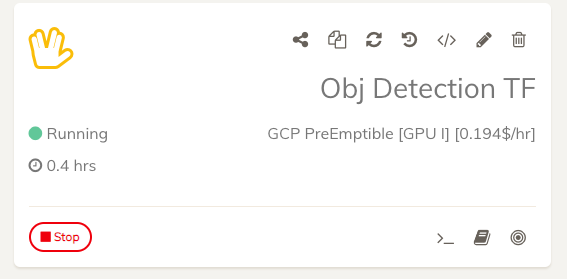

Now again you can press Start on your project and select Google Cloud Platform. You will now be presented with various GCP machine options to run your project on. You can press Start button for the machine option of your choice.

When running for the first time, you might see an error like this

This is due to GCP Compute Engine APIs not enabled yet for Clouderizer. This error message will give you a URL to enable this API. Copy and visit this URL and follow on-screen instructions to enable this API. This might take few minutes if you have signed up for GCP just now. 

Once Compute Engine APIs are enabled, you can come back to Clouderizer console and try starting the project again.
It should now trigger automated process of creating a new VM instance in GCP, setting up your project environment, downloading your code and datasets. You can track the progress of your machine setup from Clouderizer console. 

Once your project setup is ready, its status should change to Running. You can now use JupyterLab and remote terminal button to work on your project.

**Important Note**

Some users, who have signed up for GCP recently, can see this error on starting their projects

“Quota ‘GPUS_ALL_REGIONS’ exceeded. Limit: 0.0 globally.”

Please go to Compute Engine -> Quotas -> Iam and admin (hyperlink) and search for the following quota
GPUs (all region).

In case limit for this is 0, you need to request Google to increase this to 1 or whatever value you need.

